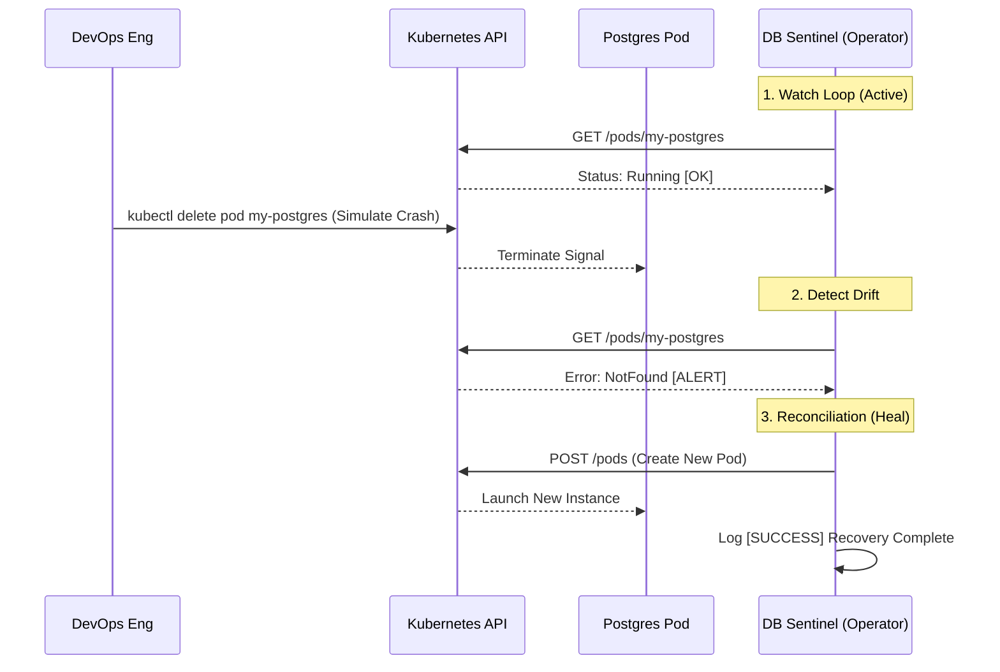

# 🛡️ DB Sentinel: Kubernetes Self-Healing Operator


**DB Sentinel** is a custom Kubernetes Controller (Operator) designed to ensure high availability for PostgreSQL database pods. 

It implements the **Kubernetes Reconciliation Loop** pattern to continuously monitor the health and presence of a specific pod (by default `my-postgres`) and automatically initiates recovery procedures—without human intervention—if a pod goes missing.

---

## 📸 Demo & Architecture

### The "Self-Healing" in Action
*(The system detecting a failure and repairing it in <2 seconds)*


*> Note: Replace `./image_493bad.png` with the actual path to your screenshot in the repo!*

### How it Works (Logic Flow)
This operator mimics the logic used by enterprise tools like **KubeDB**. It runs a control loop that constantly compares the *Desired State* (Pod exists) with the *Actual State*.



## 🚀 Features

- **🕵️ Continuous Monitoring**: Acts as a watchdog for specific Stateful workloads (default: `my-postgres`).
- **🚑 Auto-Healing**: Automatically detects CrashLoopBackOff or missing pods and triggers a rebuild.
- **☁️ Cloud-Native Authentication**:
  - **Local Dev**: Automatically uses `~/.kube/config`.
  - **Cluster Mode**: Automatically switches to `rest.InClusterConfig()` using ServiceAccount tokens.
- **🔒 RBAC Secured**: Runs with a dedicated ClusterRole following the principle of least privilege.

## 🛠️ Getting Started

### Prerequisites

- Go 1.21+
- Docker
- Kubernetes Cluster (Minikube, Kind, etc.)
- `kubectl` configured

### 1. Local Development (The "Connect" Mode)

Run the operator locally while it connects to your remote/local cluster.

```bash
# Clone the repository
git clone https://github.com/abrar-khan-alvi/k8s-db-sentinel.git
cd k8s-db-sentinel

# Run the sentinel
go run main.go
```

The application will detect it is running locally and use your `~/.kube/config`.

### 2. Deployment to Kubernetes (The "Operator" Mode)

Deploy the Sentinel as a Pod inside the cluster.

```bash
# 1. Build the Docker Image
docker build -t db-sentinel:v1 .

# 2. Load into Cluster (if using Kind)
kind load docker-image db-sentinel:v1 --name ops-lab

# 3. Apply Manifests (RBAC + Deployment)
kubectl apply -f deploy.yaml
```

**Verify Installation:**

```bash
kubectl get pods
kubectl logs -l app=db-sentinel -f
```

## 📂 Project Structure

```text
/k8s-db-sentinel
├── main.go            # Core Controller Logic (Go)
├── Dockerfile         # Multi-stage build (Alpine based)
├── deploy.yaml        # K8s Manifests (ServiceAccount, RBAC, Deployment)
├── go.mod             # Go Module definitions
└── README.md          # Documentation
```

## 🧠 Why I built this?
I built DB Sentinel to deeply understand the internals of Kubernetes Controllers and the Operator Pattern. While tools like KubeDB exist for production, writing a custom reconciler from scratch demonstrated how to programmatically interact with the client-go library, manage Context, and handle InCluster authentication securely.
